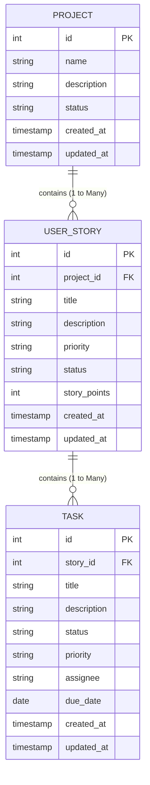

# Agile Project Management System - Database Architecture & ERD

## Entity Relationship Diagram (ERD)

---

## Data Model Specifications

### 1. `projects` Table
- **Primary Key**: `id` (INTEGER AUTOINCREMENT)
- **Relationships**: Parent of `user_stories`. On Delete Cascade deletes all related user stories.
- **Constraints**: `name` NOT NULL.

### 2. `user_stories` Table
- **Primary Key**: `id` (INTEGER AUTOINCREMENT)
- **Foreign Key**: `project_id` REFERENCES `projects(id)` ON DELETE CASCADE.
- **Relationships**: Parent of `tasks`.
- **Enums**:
  - `priority`: `LOW`, `MEDIUM`, `HIGH`
  - `status`: `TODO`, `IN_PROGRESS`, `DONE`

### 3. `tasks` Table
- **Primary Key**: `id` (INTEGER AUTOINCREMENT)
- **Foreign Key**: `story_id` REFERENCES `user_stories(id)` ON DELETE CASCADE.
- **Enums**:
  - `status`: `TODO`, `IN_PROGRESS`, `DONE`, `OVERDUE`
  - `priority`: `LOW`, `MEDIUM`, `HIGH`
